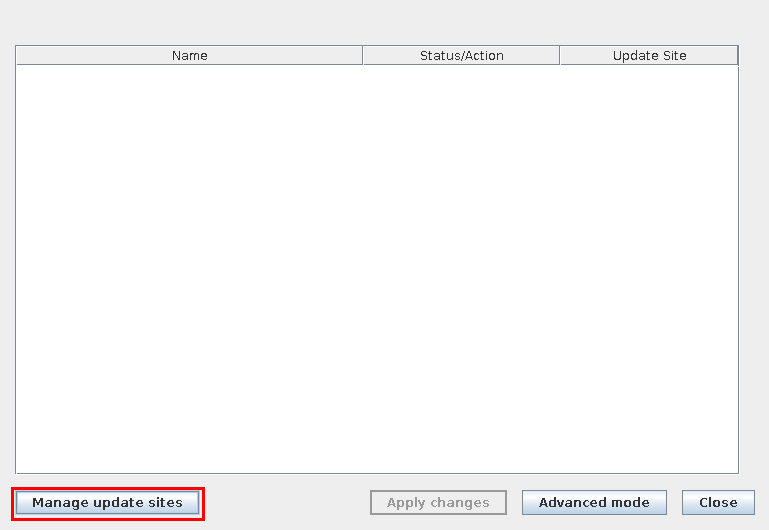

```{r setup, include=FALSE}
knitr::opts_chunk$set(echo = TRUE)
setwd("~/Insync/cbowm002@ucr.edu/Google Drive/workspace-sync/mules_testing/docs")

```

\pagebreak 


# What is MuLES?

```MuLES``` (Multiple Leaf Shape Extraction System) is a workflow based in ImageJ [cite] for quickly analyzing traditional morphometric parameters of leaf samples. The workflow combines the usage of several plugins [cite] to identify and measure different parameters relevant to object shape, such as object length, width, area, and aspect ratio. These measurements can be taken using raw images and require no initial pre-processing steps* (eg. thresholding).

A summary of the capabilities of ```MuLES``` is as follows:

* User-friendly workflow that features a graphical user interface (GUI) and does not require prior coding knowledge.
* Automated batch processing of multiple images containing one or several leaves per image, allowing for high-throughput measuring of large populations.
* Orientation-agnostic processing that can identify individual leaves in close proximity.
* Additional options for controlling how the results are output, allowing for users to incorporate the output from ```MuLES``` into other image analysis softwares (eg. MOMOCS).

# ImageJ/ Fiji installation
To use ```MuLES```, it is recommended that users install Fiji [cite], a pre-packaged distribution of the image analysis software ImageJ [cite]. This distribution comes pre-packaged with multiple plugins for use in scientific image analysis.

Additionally, ```MuLES``` requires two dependencies that can be installed through the Fiji interface.

> Help \> Update... \> Manage update sites \> (Select the following two plugins:)

* Morphology [cite]
* BioVoxxel [cite]

{width=50%} {width=50%}
{width=50%}


## Installing MuLES
```MuLES``` can be downloaded via the [Github repository](https://github.com/0cb/itwasme-DIA/mules). The download location for the MuLES.ijm file can be wherever users want, as long as it is easily accessible.

## Setting up the working directory
The ```MuLES``` workflow requires user-specification for the initial "input" and "output" directories.

**NOTE:** *It is highly recommended that users backup their original images prior to using ```MuLES```. Default naming schemes may vary between image capture devices (eg. cameras, scanners, etc.) and it is easy to accidentally overwrite images containing the same name.*


# Image Inputs
```MuLES``` can be run with almost any image format as long as it is specified. This was done to allow for batch processing of folders containing other files in addition to the desired input image files.

Images may contain one or several leaves, and leaves may be oriented in any way that is convenient. Typically, it is recommended that images contain some sort of identifier (such as accession number) to help users better organize their input files. Inputs should also be in color, rather than black & white or binary formats, but do not require a color reference card for leaf recognition. An example is included below.

{width=50%}
\newpage

```MuLES``` can also process images containing several accession or sample sets in a single image. In this case, the included ```imgSplits``` macro should be used. This function can be used to quickly split an original image into perfect squares (ie. 2x2, 3x3, etc.). An example is included below.

{width=50%} 

{width=33%} {width=33%} {width=33%}

{width=33%} {width=33%} {width=33%}

{width=33%} {width=33%} {width=33%}


\newpage
# Running MuLES

When running ```MuLES``` it is important that there are no images or projects open in the ImageJ/ Fiji software.

To run ```MuLES```, navigate the Fiji interface to the macro interface.

> Plugins \> Macros \> Edit...

{width=50%} 

Select and open the MuLES.ijm file. Once the macro is open, clicking "Run" will begin the ```MuLES``` software and prompt the user for the initial input settings.

{width=50%}


## MuLES settings
The user prompt for ```MuLES``` settings includes:

{width=50%}

* input/ output folders
* input/ output formats
* **single or multiple leaves per image**
* type of output desired
  + **Measurements only** - measurements are printed to a .csv file
  + **Masks only** - individual images are saved to the specified output format for later use (eg. visual filtering, other analysis softwares, etc.)
  + **Both** - measurements and images are saved to the specified output directory

For additional settings:

* **Colored Feret's diameter & breadth lines** - adds visual representations of the length and width as measured by ```MuLES``` (see 'MuLES output' for examples)
* **Small leaves** - reduces the stringency of ```MuLES``` when identifying leaves 
  + **NOTE** background noise/ objects may be falsely identified as a result
* **Black leaves on white background** - if "yes" is selected, output images will be black & white rather than white & black
  + for use in MOMOCS (see 'MuLES output' for examples)
* **Detailed measurements** - if "yes" is selected, the full output of measurements from ```MuLES``` will be printed to an additional .csv file
  + The full output includes measurements that are not necessarily associated with morphometric parameters, but may be useful for more detailed analyses pertaining to ___ moprhometrics; a full list of the output measurements and their meanings can be found at ## MuLES output.

After the correct settings are chosen, click "OK" to begin processing the chosen input folder. Each image in the folder will flash on the screen as they are processed and do not require any further user input.

## MuLES output
The output of ```MuLES``` will vary based on the chosen settings at initialization.

When selecting **"Masks only"** or **"Both"**, the resulting output images are shown below:

{width=25%} {width=25%}

{width=25%} {width=25%}


When selecting **"Measurements only"** or **"Both"**, the resulting measurements are output to a .csv file.

The default data table contains the following measurements:

* Area - the Area of the region as defined by the boundary pixels
* Feret - length of the largest axis
* FeretX1 - X coordinate for the start point of the line defining the 'Feret' measurement
* FeretY1 - Y coordinate for the start point of the line defining the 'Feret' measurement
* FeretX2 - X coordinate for the end point of the line defining the 'Feret' measurement
* FeretY2 - Y coordinate for the end point of the line defining the 'Feret' measurement
* FAngle - angle (degrees; 0 - 180) of the line defining the 'Feret' measurement in relation to the horizontal X axis
* Breadth - length of the largest axis that is perpendicular to the Feret line (may not be colinear)
* BrdthX1 - X coordinate for the first point of the line defining the 'Breadth' measurement
* BrdthY1 - Y coordinate for the first point of the line defining the 'Breadth' measurement
* BrdthX2 - X coordinate for the second point of the line defining the 'Breadth' measurement
* BrdthY2 - Y coordinate for the second point of the line defining the 'Breadth' measurement
* AspRatio - the Aspect Ratio as defined by AspRatio = Feret/ Breadth
* PrLen1 - length of the perpendicular line originating from the first Breadth point
* PrLen2 - length of the perpendicular line originating from the second Breadth point


When choosing the **"Detailed measurements file"** option, all the default measurements as well as additional measurements are output to a different .csv file. Many of these measurements come from the "Particles8" plugin found in the ```Morphology``` package included in the ```MuLES``` workflow and can be referenced at the original website (test)[test]. A description of relevant measurements are also included below for reference:

* Perim - the Perimeter of the region as defined by the boundary pixels
* Circ - 
* Roundness - 
* Concavity -
* Convexity -
