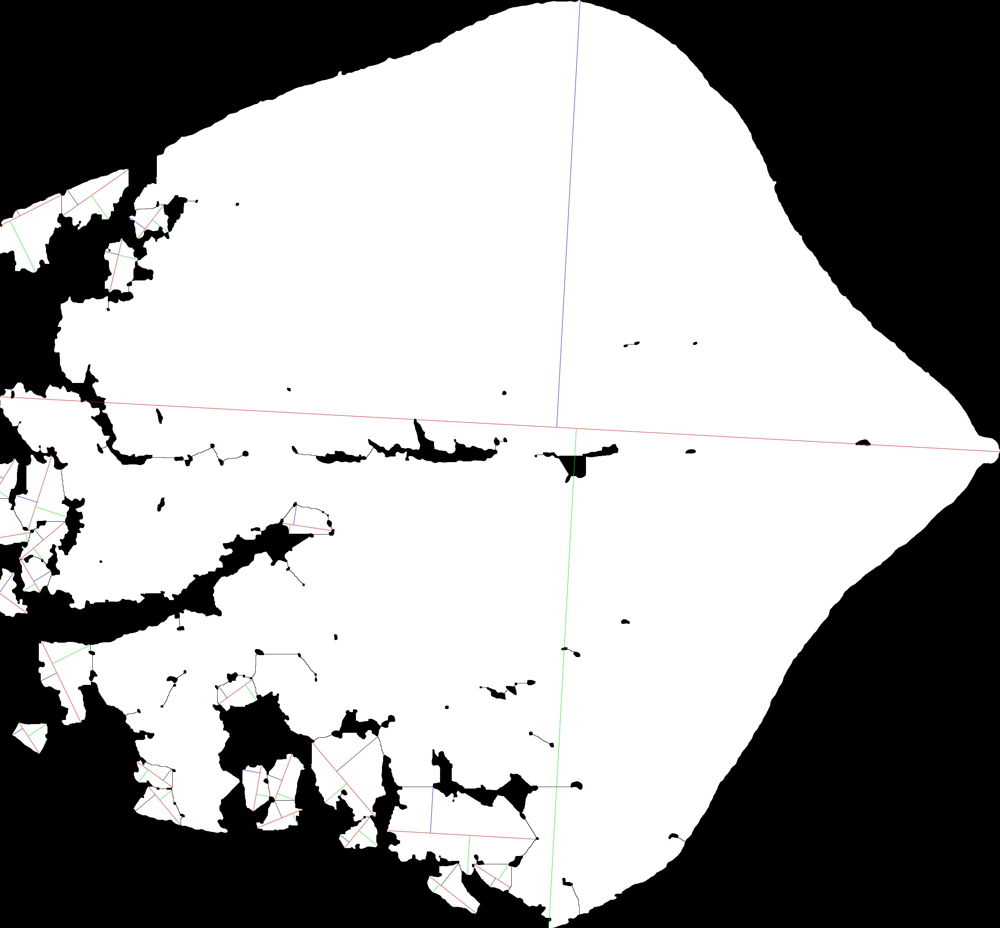

```{r setup, include=FALSE}
knitr::opts_chunk$set(echo = TRUE)
setwd("~/gitrekt/mules/docs")

```

\pagebreak 


# What is MuLES?

```MuLES``` (Multiple Leaf Shape Extraction System) is a workflow based in ImageJ (Schneider et al., 2012) for quickly analyzing traditional morphometric parameters of simple leaf type samples. The workflow utilizes plugins published for use in ImageJ to identify and measure different parameters relevant to object shape, such as object length, width, area, and aspect ratio. These measurements can be taken using raw input images and require no initial pre-processing steps (eg. thresholding).

A summary of the capabilities of ```MuLES``` is as follows:

* User-friendly workflow that features a graphical user interface (GUI) and does not require prior coding knowledge.
* Automated batch processing of multiple images containing one or several leaves per image, allowing for high-throughput measuring of large populations.
* Orientation-agnostic processing that can identify individual leaves in close proximity.
* Additional options for controlling how the results are output, allowing for users to incorporate the output from ```MuLES``` into other image analysis softwares (eg. Momocs).

&nbsp;

Video walkthroughs demonstrating the ```MuLES``` and ```imgSplit``` workflows can be found at:

* https://www.youtube.com/watch?v=vtj93rbDO28 (MuLES) 
* https://www.youtube.com/watch?v=9HVsNvAWPjE (imgSplit)

# ImageJ/ Fiji installation
To use ```MuLES```, it is recommended that users install Fiji (Schindelin et al., 2012), a pre-packaged distribution of the image analysis software ImageJ. This distribution comes pre-packaged with multiple plugins for use in scientific image analysis.

Additionally, ```MuLES``` requires two dependencies that can be installed through the Fiji interface.

```> Help > Update... > Manage update sites > (Select the following two plugins:)```

* Morphology (Landini, 2008)
* BioVoxxel (Brocher, 2022)

&nbsp;

```{r plugins, fig.align="center", out.height="70%", out.width="70%", echo=FALSE}
knitr::include_graphics("demo_imgs/plugins_01.png")
knitr::include_graphics("demo_imgs/plugins_02.png")
knitr::include_graphics("demo_imgs/plugins_03.png")
```

&nbsp;

## Installing MuLES
```MuLES``` can be downloaded via the [Github repository](https://github.com/0cb/mules) (https://github.com/0cb/mules). After downloading ```MuLES```, users are not required to move the Mules.ijm file to a specific location, as long as it is easily accessible.

## Setting up the working directory
The ```MuLES``` workflow requires user-specification for the initial "input" and "output" directories.

**NOTE:** *It is highly recommended that users backup their original images prior to using ```MuLES```. Default naming schemes may vary between image capture devices (eg. cameras, scanners, etc.) and it is easy to accidentally overwrite images containing the same name.*


# Image Inputs
```MuLES``` can be run with almost any image format as long as it is specified. This allows for batch processing of folders containing other files in addition to the desired input image files.

Images may contain one or several leaves, and leaves may be oriented in any way that is convenient. Typically, it is recommended that images contain an identifier (such as accession number) to help users better organize their input files. Inputs should also be in color, rather than black & white or binary formats, but do not require a color reference card for leaf recognition. An example is included below.

&nbsp;

```{r SampleImg, fig.align="center", out.height="35%", out.width="35%", echo=FALSE}

```

&nbsp;

```MuLES``` can also process images containing several accession or sample sets in a single image. In this case, the included ```imgSplits``` macro should be used. This function can be used to quickly split an original image into perfect squares (ie. 2 x 2, 3 x 3, etc.). An example is included below that shows a single image containing multiple leaf accessions in a 3 x 3 grid is split into 9 individual images after using ```imgSplit```.

```{r imgSplit, fig.align="center", out.height="75%", out.width="75%", echo=FALSE}
knitr::include_graphics("demo_imgs/imgSplit.jpg")
```

\pagebreak
# Running MuLES

When running ```MuLES``` it is important that there are no images or projects open in the ImageJ/ Fiji software.

To run ```MuLES```, navigate the Fiji interface to the macro interface.

```> Plugins > Macros > Edit...```

```{r mules01, fig.align="center", out.height="75%", out.width="75%", echo=FALSE}
knitr::include_graphics("demo_imgs/mules_01.png")
```

&nbsp;

Select and open the MuLES.ijm file. Once the macro is open, clicking "Run" will begin the ```MuLES``` software and prompt the user for the initial input settings.

&nbsp;

```{r mules02, fig.align="center", out.height="60%", out.width="60%", echo=FALSE}

```

&nbsp;

## MuLES settings
The user prompt for ```MuLES``` settings includes:

&nbsp;

&nbsp;

```{r GUI, fig.align="center", out.height="60%", out.width="60%", echo=FALSE}

```

&nbsp;

* input/ output folders
* input/ output formats
* type of output desired
  + **Measurements only** - measurements are printed to a .csv file
  + **Masks only** - individual images are saved to the specified output format for later use (eg. visual filtering, other analysis softwares, etc.)
  + **Both** - measurements and images are saved to the specified output directory

&nbsp;

For additional settings:

* **Colored Feret's diameter & breadth lines** - adds visual representations of the length and width as measured by ```MuLES``` (see 'MuLES output' for examples)
* **Small leaves** - reduces the stringency of ```MuLES``` when identifying leaves 
  + **NOTE** background noise/ objects may be falsely identified as a result
* **Black leaves on white background** - if "yes" is selected, output images will be black & white rather than white & black (see 'MuLES output' for examples)
* **Filtering based on LAR standard deviation** - if "yes" is selected, the standard deviation for the aspect ratio of each object will be measured and used as a metric to recommend leaves for removal from further analyses. Output images of leaves will have "-outlier" appended to the file name if they lie outside of the user-specified standard deviation limit.
  + **NOTE** this filter is only applied to leaf objects PER image; images containing a single leaf should not be used with this filter, as any "-outlier" tags will be potentially misleading
* **Dark leaves on black background** - this option is intended to assist with troubleshooting when leaves are of a similar color to the image background.

&nbsp;

After the correct settings are chosen, click "OK" to begin processing the chosen input folder. Each image in the folder will flash on the screen as they are processed and do not require any further user input.

&nbsp;

## MuLES output
The output of ```MuLES``` will vary based on the chosen settings at initialization.

When selecting **"Masks only"** or **"Both"** for **"Desired outputs?"**, the resulting output images are shown below:

&nbsp;

{width=25%} {width=25%}

{width=25%} {width=25%}

(Top left): "Black leaves on white background" = No; "Colored Feret's diameter & breadth lines" = No

(Top right): "Black leaves on white background" = No; "Colored Feret's diameter & breadth lines" = Yes

(Bottom left): "Black leaves on white background" = Yes; "Colored Feret's diameter & breadth lines" = No

(Bottom right): "Black leaves on white background" = Yes; "Colored Feret's diameter & breadth lines" = Yes

&nbsp;

The following image is an example for when selecting **"Yes"** for **"Dark leaf on black background"** may be more appropriate:

**NOTE** *this troubleshooting feature may lead to partial leaf object recognition as shown below*

&nbsp;

{width=50%} 

{width=25%} {width=25%}

(Left): "Dark leaf on black background" = Yes

(Right): "Dark leaf on black background" = No

&nbsp;

When selecting **"Measurements only"** or **"Both"** for **"Desired outputs?"**, a data table will be produced in the form of a .csv.

The data table contains the following measurements:

* **Area** - the Area of the region as defined by the boundary pixels
* **Feret** - length of the largest axis
* **FeretX1** - X coordinate for the start point of the line defining the 'Feret' measurement
* **FeretY1** - Y coordinate for the start point of the line defining the 'Feret' measurement
* **FeretX2** - X coordinate for the end point of the line defining the 'Feret' measurement
* **FeretY2** - Y coordinate for the end point of the line defining the 'Feret' measurement
* **FAngle** - angle (degrees; 0 - 180) of the line defining the 'Feret' measurement in relation to the X axis
* **Breadth** - length of the largest axis that is perpendicular to the Feret line (may not be colinear)
* **BrdthX1** - X coordinate for the first point of the line defining the 'Breadth' measurement
* **BrdthY1** - Y coordinate for the first point of the line defining the 'Breadth' measurement
* **BrdthX2** - X coordinate for the second point of the line defining the 'Breadth' measurement
* **BrdthY2** - Y coordinate for the second point of the line defining the 'Breadth' measurement
* **AspRatio** - the Aspect Ratio as defined by AspRatio = Feret/ Breadth
* **PrLen1** - length of the perpendicular line originating from the first Breadth point
* **PrLen2** - length of the perpendicular line originating from the second Breadth point

&nbsp;


# References
Brocher, J. 2022. biovoxxel/BioVoxxel-Toolbox: BioVoxxel Toolbox. Zenodo.

Landini, G. 2008. Advanced shape analysis with ImageJ. Proceedings of the Second ImageJ User and Developer Conference, Luxembourg, 116–121.

Schindelin, J., I. Arganda-Carreras, E. Frise, V. Kaynig, M. Longair, T. Pietzsch, S. Preibisch, et al. 2012. Fiji: an open-source platform for biological-image analysis. Nature Methods 9: 676–682.

Schneider, C. A., W. S. Rasband, and K. W. Eliceiri. 2012. NIH Image to ImageJ: 25 years of image analysis. Nature Methods 9: 671–675.
